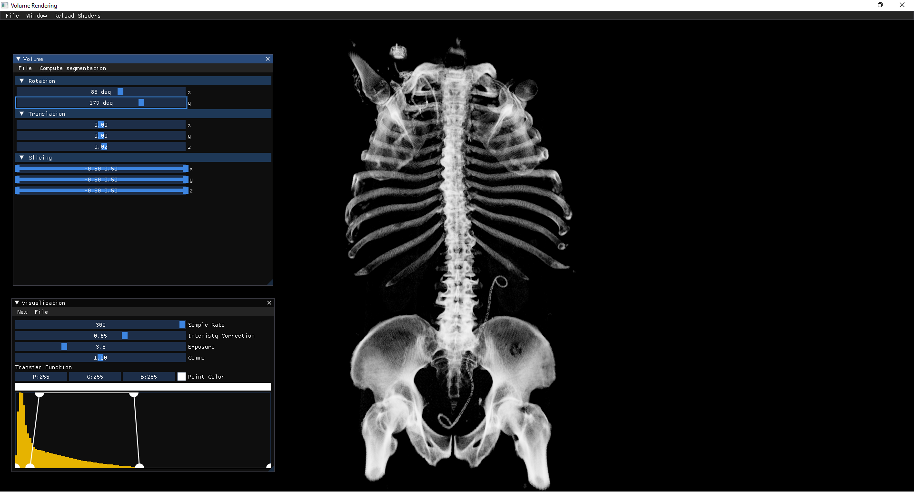
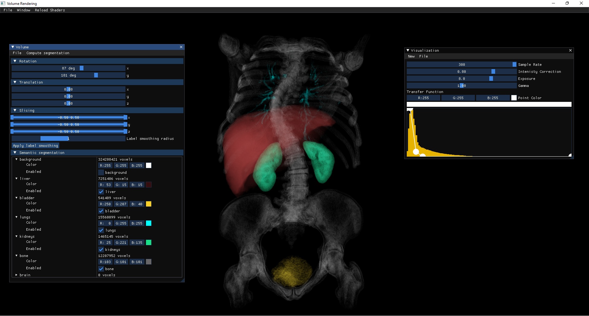

# Volume Rendering: a C++ application for visualisation of medical image data

This project was made as a Bachelor's thesis in Computer Engineering, Gheorghe Asachi​ Technical University of Iași 2022.

## About

Using non-invasive diagnostic methods such as computed tomography or nuclear magnetic resonance, a structured, three-dimensional volume of data results, with point values ​​representing varying intensities for different tissue types. The visualization method ray casting allows, unlike surface visualization methods, to visualize the interior of the volume without using the method clipping planes. In volume rendering, transfer functions are used to determine voxel properties in color and opacity using luminance values.

In this thesis, an implementation of a medical data visualization application using the ray casting technique is proposed. Using this application, one-dimensional transfer functions can be created that assign for different values ​​of intensity in data volume, color and transparency.

Because different organs may have similar tissues, thus similar intensity values, it is difficult to construct a one-dimensional transfer function that clearly distinguishes between two or more similar regions. A solution proposed in this paper is the construction of a semantic segmentation mask with the help of a neural network. The application allows the assignment of colors and transparency for each available segmentation class, these values ​​being combined with those of the transfer function.

## Screenshots

